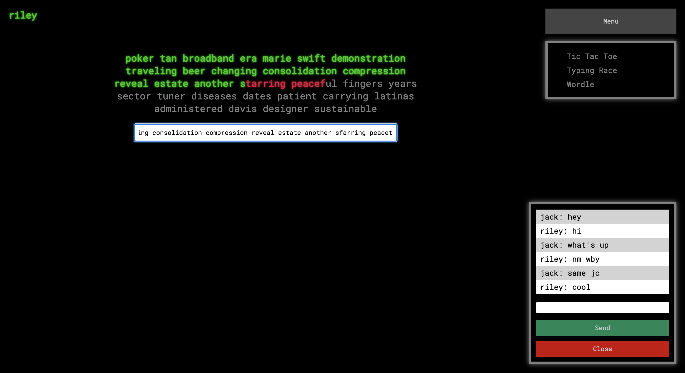

# rooms

A site for live 2 player games such as Worlde, typing races and tic-tac-toe. Also has a chat feature for communication between players.

https://game-rooms.herokuapp.com

To run locally:

`$ git clone https://github.com/rileythomp/rooms`

`$ cd rooms`

`$ npm i`

`$ npm run start`

Requiers node and npm to be installed.
